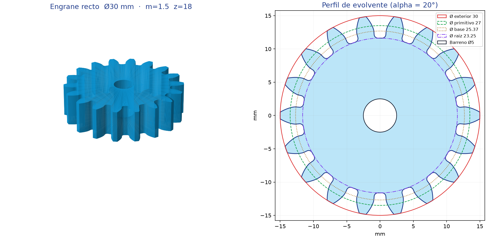

# Engrane recto Ø30 mm

Modelo 3D paramétrico de un engrane recto (spur gear) con perfil de **evolvente**
real, generado por código y exportado a STL.



## Especificación

| Parámetro | Símbolo | Valor |
|---|---|---|
| Módulo | m | 1.5 mm |
| Número de dientes | z | 18 |
| Ángulo de presión | α | 20° |
| **Diámetro exterior** | da | **30.00 mm** |
| Diámetro primitivo | d | 27.00 mm |
| Diámetro de raíz | df | 23.25 mm |
| Diámetro base | db | 25.37 mm |
| Paso circular | p = π·m | 4.712 mm |
| Ancho de cara | b | 8 mm |
| Barreno | — | Ø5 mm |
| Radio de filete de raíz | ρ | 0.57 mm (0.38·m) |

El diámetro que se pidió (30 mm) es el **exterior**, es decir la punta de los
dientes: `da = m·(z + 2) = 1.5 · 20 = 30 mm`. La distancia entre centros al
engranar con otro engrane de la misma familia es `a = m·(z₁ + z₂)/2`; con dos
engranes iguales, 27 mm.

## Archivos

| Archivo | Contenido |
|---|---|
| `engrane-30mm.stl` | Malla STL binaria, cerrada (6 720 triángulos) |
| `visor.html` | Visor 3D interactivo, autocontenido (WebGL, sin dependencias) |
| `engrane-30mm.png` | Render de verificación: vista 3D + perfil acotado |
| `gear.py` | Generador paramétrico (solo librería estándar) |
| `viewer.py` | Construye `visor.html` incrustando la malla |
| `preview.py` | Construye el render PNG (requiere numpy + matplotlib) |

## Regenerar

```bash
cd models/engrane-30mm

# STL con los valores por defecto (Ø exterior 30 mm)
python3 gear.py

# Otras variantes: el módulo y el número de dientes fijan el diámetro
python3 gear.py --modulo 1 --dientes 28 --ancho 6 --barreno 4 --salida otro.stl

# Visor 3D y render
python3 viewer.py visor.html
python3 preview.py engrane-30mm.png     # requiere: pip install numpy matplotlib
```

Parámetros de `gear.py`: `--modulo`, `--dientes`, `--angulo`, `--ancho`,
`--barreno`, `--juego`, `--salida`.

## Cómo se construye la geometría

1. **Flanco**: evolvente del círculo base `rb = r·cos α`, muestreada por ángulo de
   rodadura entre el radio de arranque y el de cabeza. El diente se coloca de modo
   que su espesor circular en el diámetro primitivo sea `π·m/2`.
2. **Filete de raíz**: arco de radio `0.38·m` tangente al círculo de raíz y al
   flanco; el centro se localiza por bisección y el flanco se recorta en el punto
   de tangencia.
3. **Cabeza y fondo**: arcos sobre los círculos de cabeza y de raíz que cierran el
   perfil; el diente se replica `z` veces.
4. **Extrusión**: paredes exterior e interior más las dos caras, trianguladas en
   cremallera entre el contorno (1 584 puntos) y el barreno (96 puntos) para
   evitar triángulos degenerados.

La malla resultante es **cerrada y manifold** (toda arista pertenece a exactamente
dos triángulos) y su volumen coincide con el analítico: 4 314.6 mm³.

## Impresión 3D

El modelo es nominal, sin juego (`--juego 0`). Para que dos piezas impresas
engranen sin agarrotarse conviene generar con `--juego 0.2` aproximadamente, o
aplicar un *horizontal expansion* de −0.1 mm en el laminador. Orientar la cara
plana sobre la placa; no requiere soportes.
