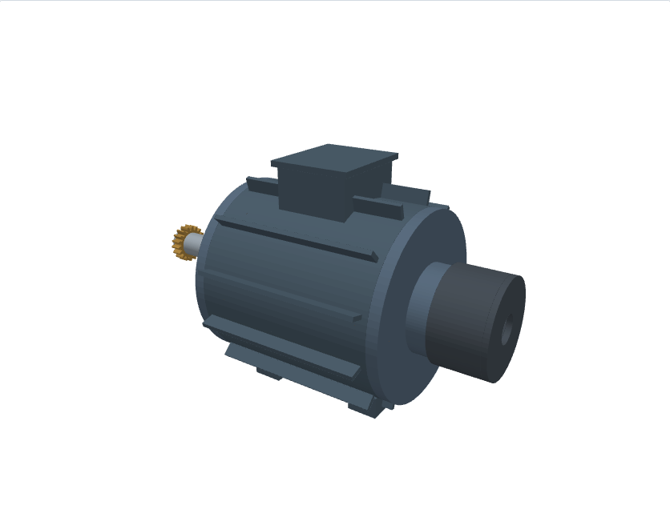
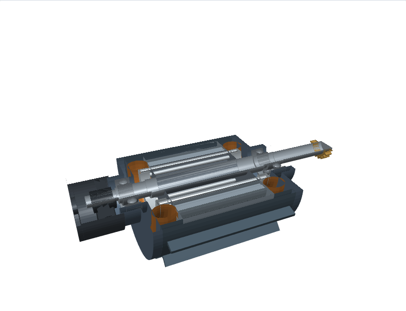
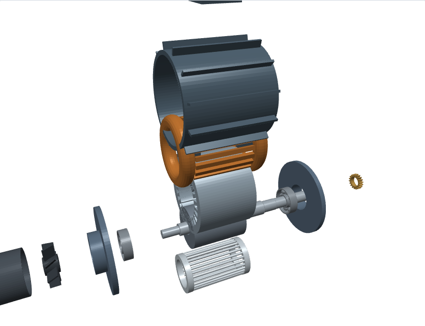

# Motor asíncrono trifásico IEC 80

Sistema 3D completo de un motor eléctrico de jaula de ardilla (0.75 kW, 4 polos),
modelado pieza a pieza por código: **14 piezas**, cada una con su material, su masa
y su STL independiente, más el conjunto montado.



| Vista en corte | Despiece |
|---|---|
|  |  |

## Características

| | |
|---|---|
| Potencia / polos | 0.75 kW · 4 polos · 1400 min⁻¹ |
| Tamaño de carcasa | IEC 80 (altura de eje 80 mm) |
| Estator | Ø120 / Ø70, paquete 90 mm, 24 ranuras |
| Rotor | Ø69.4, 28 barras, jaula de aluminio inyectado |
| Entrehierro | 0.3 mm |
| Rodamientos | 2 × 6204-2RS (20 × 47 × 14) |
| Eje de salida | Ø19 mm con piñón Ø30 |
| Dimensiones del conjunto | 148 × 170 × 284 mm |
| Masa estimada | 12.1 kg |

## Despiece

| Pieza | Material | Masa | Notas |
|---|---|---:|---|
| Carcasa | Aluminio inyectado | 1086 g | Ø132, 12 aletas hasta Ø152, patas |
| Escudo delantero | Aluminio inyectado | 317 g | Alojamiento del 6204 |
| Escudo trasero | Aluminio inyectado | 317 g | Alojamiento del 6204 |
| Estator | Chapa magnética M400-50A | 3990 g | Corona + 24 dientes de flancos paralelos |
| Bobinado | Cobre esmaltado clase F | 2405 g | 24 conductores de ranura + 2 cabezas de bobina |
| Rotor | Chapa magnética M400-50A | 2291 g | Ø69.4 × 90 |
| Jaula de ardilla | Aluminio inyectado | 210 g | 28 barras + 2 anillos de cortocircuito |
| Eje | Acero C45 | 751 g | Escalonado Ø19 / Ø20 / Ø24 |
| Rodamientos (2) | 6204-2RS | 72 g c/u | Aros y 8 bolas cada uno |
| Ventilador | Poliamida | 15 g | 8 álabes inclinados 28° |
| Cubierta del ventilador | Chapa de acero | 218 g | Deflector sobre las aletas |
| Caja de bornes | Aluminio inyectado | 294 g | Cuerpo y tapa |
| Piñón de salida | Acero cementado | 17 g | Engrane m=1.5 z=18, barreno Ø19 |

Las masas se calculan a partir del volumen encerrado por cada sólido y la densidad
del material: sirven para comparar piezas, no como peso certificado.

## Archivos

| Archivo | Contenido |
|---|---|
| `visor.html` | Visor 3D interactivo autocontenido: giro, despiece progresivo, corte y encendido/apagado de cada pieza |
| `motor.stl` | Conjunto completo (32 800 triángulos) |
| `piezas/*.stl` | Las 14 piezas por separado |
| `solids.py` | Primitivas: revolución, prisma, esfera, patrón polar, escritura STL |
| `motor.py` | Definición del motor: cotas, piezas, materiales y despiece |
| `viewer.py` | Construye `visor.html` incrustando la geometría en base64 |
| `capturas.py` | Saca las tres imágenes de este README desde el visor |

## Regenerar

```bash
cd models/motor-electrico

python3 motor.py --lista        # despiece con masas, sin escribir nada
python3 motor.py                # motor.stl + piezas/*.stl
python3 viewer.py visor.html    # visor 3D
python3 capturas.py             # imágenes (requiere playwright + chromium)
```

`motor.py` y `solids.py` solo usan la librería estándar. `capturas.py` es lo único
que necesita dependencias externas, y únicamente para la documentación.

## Cómo está construida la geometría

- **Revolución** (`solids.revolve`): perfil cerrado `(r, z)` girado alrededor de Z.
  De ahí salen carcasa, escudos, eje escalonado, aros de rodamiento, cabezas de
  bobina (un toro de sección elíptica) y cubierta. Los puntos con `r = 0` colapsan
  sobre el eje y su cuadrilátero degenera en triángulo, así que los sólidos macizos
  quedan cerrados.
- **Prismas** (`solids.prism`): polígono extruido con tapas en abanico desde el
  centroide. Dientes del estator, conductores de ranura, aletas, álabes y cajas.
- **Patrón polar** (`solids.polar`): repite un sólido alrededor del eje — 24 dientes,
  24 conductores, 28 barras, 12 aletas, 8 álabes, 8 bolas por rodamiento.

Cada pieza es una unión de sólidos cerrados que se tocan (el estator, por ejemplo, es
la corona más 24 dientes). No se calculan booleanas: para STL y para el visor el
resultado es equivalente, y cualquier laminador une los sólidos al rebanar.

## Límites del modelo

- El corte del visor descarta los fragmentos con `y > 0`; las superficies seccionadas
  no se tapan, así que en el corte se ve el interior hueco de cada pieza. Es una
  vista de inspección, no una sección normalizada de plano.
- El bobinado está representado por su volumen (conductores de ranura y cabezas de
  bobina), no conductor a conductor, y no distingue las tres fases.
- No hay tornillería, chavetero, retenes ni placa de bornes en detalle.
- Las cotas siguen la práctica de un IEC 80 pero no reproducen ningún fabricante
  concreto; antes de fabricar hay que contrastarlas con la norma y con el diseño
  electromagnético.
